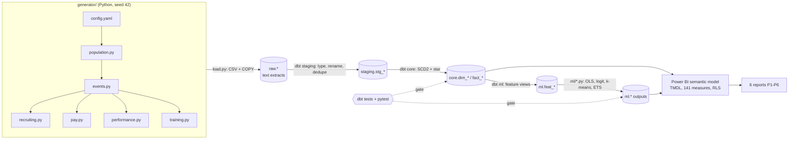

# People Analytics Warehouse

A synthetic, production-style people analytics stack for a 60,000-employee airline, scaled to one
population of **6,000 employees (2018-2025)**. It runs end to end:
seeded generator → Postgres → dbt (staging → core → ml features) → Python models → Power BI (PBIP/TMDL).

Everything is synthetic. No real person, employer or record is represented.

## Architecture



```
make data   generator  ──► raw.*        (14 source extracts, planted duplicates)
make dbt    dbt build  ──► staging.* ─► core.* ─► ml.feat_*   (every model tested before its children build)
make ml     python -m ml ─► ml.*        (prints planted-effect scorecard, exits 1 if one is not recovered)
make test   pytest + dbt test           (generator, warehouse, semantic model, ml outputs)
make all    all of the above from an empty database
```

Power BI shows, it does not model: every statistic is fitted in Python and written to `ml.*`; the
semantic model only reads.

## Quick start

Requirements: Docker, Python 3.11, `make`. Power BI Desktop (Windows) for the reports.

```bash
pip install -r requirements.txt
make reset      # optional: drop the Postgres volume so the run starts from an empty database
make all
```

`make all` from an empty database (after `make reset`) measured **128 s** on a 4-core machine, exit code 0:
164 dbt nodes built and tested, 5/5 planted effects recovered, 23 ML-output tests, 20 pytest tests, 153 dbt tests.

Open the model in Power BI Desktop:

1. Open `powerbi/PeopleAnalytics.pbip` (P1 Recruitment). The other reports open via `P2_Forecasting.pbip` ... `P6_Learning.pbip`; all six share `PeopleAnalytics.SemanticModel`.
2. Parameters `PgServer` = `localhost:5432`, `PgDatabase` = `people_analytics` (Transform data → Edit parameters).
3. Refresh. Credentials: Database, user `pa`, password `pa_local_only`. The local container has no TLS, so accept "connect without encryption" when asked.
4. Build each page by hand from `powerbi/pages_spec/P*.md`; check the three numbers per report in `docs/validation.md`.

## Planted effects and recovery

Printed at the end of `make ml` (values for seed 42):

| Effect | Planted | Recovered (95% CI) | Method |
|---|---|---|---|
| Adjusted gender pay gap | -4.0% (after all legitimate factors) | **-3.80%** [-4.19, -3.40] | OLS on log base pay, `ml/pay_equity.py` |
| Attrition odds ratio, commute > 30 km | 1.8 | **1.99** [1.75, 2.27] | Logistic regression, `ml/attrition.py` |
| Attrition odds ratio, training > 20 h/yr | 0.6 | **0.58** [0.49, 0.67] | same model |
| Seasonal hiring peak | Sep-Nov | **Sep, Oct, Nov** (index 1.59 / 1.46 / 1.30) | Seasonal index, `ml/forecast.py` |
| Learner archetypes (5) | 5 archetypes | **k = 5, ARI 0.77** | k-means, `ml/learner_segments.py` |

Other planted structure: tenure-dependent exit hazard (monthly voluntary hazard 1.0% in months 0-2,
**2.1% in months 3-12**, 1.2% in months 13-24, 0.5% after 5 years), rating 1-2 raises exit odds
(OR 1.57), age < 30 raises them (OR 1.42), and a 2023 re-org that moves Airport Services from Commercial
to Flight Operations. Gender, grade band and division have **no** planted attrition effect; the model
reports them as associations with wide intervals.

Model quality: attrition AUC 0.70 on the held-out 30% of employees; headcount forecast MAPE 0.2% at 1
month, 1.2% at 12 months, 0.96% averaged over 24 months (25 rolling origins).

## Realism targets vs achieved

| Target (brief) | Achieved |
|---|---|
| 6,000 employees, one population | 6,000 unique `emp_id`, 12,301 SCD2 versions; every fact keys to `employee_key` |
| ~14% annual turnover | 13.9% (2018-2025 mean; 2018 is 16.0% as the opening population settles) |
| 78% of exits voluntary | 77.7% |
| Hazard highest in months 3-12 | 2.1%/month in months 3-12 vs 1.0% in months 0-2 |
| Hiring peak Sep-Nov | 36.3% of hires in Sep-Nov (25% if flat) |
| 400 requisitions / year | 436 opened / year = 400 external hires + ~21 internal fills + ~15 cancelled |
| Channel yields 25/12/4/3/10/5% | Internal 24.4, Referral 11.8, LinkedIn 4.0, Job board 3.0, Agency 10.1, Campus 4.9 |
| Pay log-normal by grade, bands min/mid/max | Compa-ratio mean 0.99 (sd 0.10); bands ±20% of mid, +2.5% a year |
| Ratings 5/15/45/25/10 | Drawn exactly; in the warehouse 4.3/14.1/44.9/26.0/10.6 because low performers exit more |
| Potential correlated 0.3 with rating | r = 0.29 |
| Internal mobility ~8%/yr, promotions ~6%/yr | 8.2% (re-org excluded), 6.5% |
| Re-org moves a whole department in 2023 | 364 employees moved on 1-Jul-2023 (`move_type = Reorg`) |

## Data model

Star schema in `core`, grain enforced by tests. Diagram: [docs/erd.md](docs/erd.md).

| Table | Grain | Rows |
|---|---|---|
| `dim_employee` | employee version (SCD2) | 12,301 |
| `dim_date` | day, 2017-01-01 .. 2027-12-31, fiscal Apr-Mar | 4,017 |
| `dim_org_unit` | team version (division > department > section > team) | 93 |
| `dim_job`, `dim_location`, `dim_channel`, `dim_program` | job / station / channel / course | 35 / 6 / 6 / 36 |
| `fact_headcount_monthly` | employee x month end | 272,782 |
| `fact_employee_event` | hire / exit / move / promotion | 9,915 |
| `fact_separation` | exit (view over events, with tenure) | 3,124 |
| `fact_compensation` | employee x 1-April pay review | 22,473 |
| `fact_requisition` | requisition (accumulating snapshot) | 3,517 |
| `fact_application` | candidate x requisition | 68,923 |
| `fact_performance` | employee x review year | 21,642 |
| `fact_training` | employee x course x completion date | 103,539 |

ML outputs (`ml` schema, written by Python): `attrition_scores`, `attrition_coefficients`, `attrition_roc`,
`attrition_metrics`, `pay_coefficients`, `pay_residuals`, `training_segments`, `headcount_forecast`.

Metric definitions: [docs/metric_dictionary.md](docs/metric_dictionary.md) (141 measures, generated from
the model's own descriptions and annotations; a test fails if the two drift apart).

## Quality gates

| Gate | What it proves |
|---|---|
| `dbt build` (130 tests on staging/core/features) | Keys unique / not null, relationships, accepted values; staging removed the planted duplicates |
| `assert_headcount_reconciliation` | headcount(m) = headcount(m-1) + hires - exits for **all 96 months** |
| `assert_scd2_versions_contiguous` | no gaps or overlaps in employee versions, one current version each |
| `assert_fact_keys_match_version_dates` | every fact row points at the version valid on its date |
| `assert_every_external_hire_has_a_requisition` | recruiting and HR describe the same people |
| `python -m ml` | planted effects recovered, exit code 1 otherwise |
| `dbt test --select tag:ml_output` | ML outputs are in range and join to the one population |
| `tests/test_generator.py` | same seed gives identical data; realism targets hold |
| `tests/test_warehouse.py` | reconciliation recomputed independently in pandas; effects recovered |
| `tests/test_semantic_model.py` | every DAX reference resolves, ratios use `DIVIDE()`, relationships single-direction, dictionary == model |

The TMDL was also deserialised with Microsoft's TOM library (`Microsoft.AnalysisServices` 19.84) during
development: 31 tables, 310 columns, 141 measures, 54 relationships, 1 role, no errors. DAX was **not**
executed (no engine outside Power BI), so the final check is opening the PBIP in Desktop.

## Synthetic data: every column

All source extracts land in `raw` as text, one table per source system. `extracted_at` is the extract
timestamp; a small share of rows is re-extracted with a later timestamp (planted duplicates, removed in staging:
0.5% of job history, 0.3% of applications, 1% of LMS completions).

### HRIS

| Table.column | Meaning | How it is generated |
|---|---|---|
| `hris_persons.emp_id` | Employee id `E00001..E06000` | Sequential in hire-date order |
| `.legal_sex` | F / M | Bernoulli by job family and rung: lowest-rung female share per family (Cabin Crew 72%, Flight Deck 7%, Engineering 6%, Corporate 52% ...), falling 30% toward the top rung |
| `.nationality` | 9 groups | Categorical (National 30%, Indian 17%, Filipino 12%, ...); no planted effect |
| `.date_of_birth` | Birth date | Hire date minus age at hire ~ N(24 + 14 x rung share, 3.5), clipped 19-55 |
| `.original_hire_date` | First day | Opening 2,800: truncated exponential tenure (mean 7.5 y, max 27.5 y) before 2018; 3,200 hires: 400 a year by month weights (Sep 13%, Oct 12%, Nov 11%) |
| `.home_commute_km` | Home to station | Log-normal, median 18 km, sigma 0.75 (25% > 30 km) - **planted attrition effect** |
| `.fte` | 1.0 / 0.8 / 0.5 | 95 / 3 / 2%; Flight Deck always 1.0 |
| `hris_job_history.*` | Effective-dated actions: `HIRE`, `PROMOTION`, `TRANSFER`, `INTERNAL_HIRE`, `REORG`, `TERMINATION` with `team_code`, `job_code` | Annual simulation in `events.py` (below) |
| `.term_type` | Voluntary / Involuntary / Retirement / Transfer | Voluntary from the planted logistic model; involuntary by last rating (17% for rating 1); retirement 10% at 58-59, 55% at 60+; transfer 0.5% |
| `.regret_flag` | Y / N | Voluntary exit with last rating >= 4, potential 3 or a critical role |
| `.notice_date` | Notice given | Exit minus 30 days (voluntary; 90 for G9+ and pilots), 7 (involuntary), 90 (retirement), 30 (transfer) |
| `.requisition_ref` | Link for internal fills | `INT0001..` |
| `hris_org_units.*` | 4 divisions, 20 departments, 81 teams, station per team | Fixed tree in `population.py`; Airport Services teams get a second version from 2023-07-01 under Flight Operations |
| `hris_jobs.*` | 35 jobs in 7 families, grades G1-G12, `critical_role` Y/N | Fixed ladders (e.g. Second Officer G7 → First Officer G8 → Captain G10 → Training Captain G11) |
| `hris_locations.*` | HUB, MRO, LHR, FRA, BOM, SIN | Fixed |

Event simulation (`events.py`), each year Y:
1. Everyone active on 31-Dec of Y-1 draws a voluntary exit for year Y with
   `logit(p) = -2.40 + tenure band + ln(1.8)·[commute > 30 km] + ln(0.6)·[training hours in Y-1 > 20] + rating band + 0.35·[age < 30]`
   (tenure bands 0-6m +0.90, 6-12m +0.60, 1-2y +0.30, 2-5y 0, 5-10y -0.35, 10y+ -0.70; rating 1-2 +0.45, 4-5 -0.15). Exit date uniform in the year.
2. New hires face monthly hazards by tenure month (voluntary 0.3%, 0.4%, 0.6%, then 2.0% from month 3; commute and age effects on the odds scale).
3. Promotions on 1 April by last rating (3: 3.5%, 4: 13%, 5: 26%); lateral moves at 8.5% per employee-year within family and station; ~22 internal requisition fills a year (half one grade up); the 2023 re-org.
4. Training completions for everyone active; 5. ratings on 31-Dec for everyone with 3+ months of service.

### Performance, LMS, payroll, ATS

| Table.column | Meaning | How it is generated |
|---|---|---|
| `perf_reviews.rating` | 1-5 | Latent `0.6·person trait + 0.8·noise`, cut at normal quantiles for 5/15/45/25/10% |
| `perf_reviews.potential` | 1-3 | Latent correlated 0.354 with the rating latent (calibrated so the discrete Pearson r = 0.30), cut 25/50/25% |
| `perf_reviews.review_date` | 31-Dec of review year | Only employees active that day with 92+ days of service |
| `lms_courses.*` | 36 courses: category, hours (1-24), cost, `mandatory_for`, delivery | Fixed catalogue in `training.py` |
| `lms_completions.*` | Course completions | Mandatory recurrent courses by family (Flight Deck 16 h ... Corporate 3 h) + 24 h onboarding in the hire year + electives: log-normal hours (median 7 h, sigma 0.8, 60% driven by a learner trait) x archetype multiplier, drawn from the archetype's preferred categories. **Planted archetypes:** Compliance only 35%, Technical deep-diver 25%, Leadership track 15%, Digital upskiller 15%, Minimal engagement 10% |
| `comp_pay_bands.*` | Grade band min/mid/max per year | 2018 mids G1 $18k ... G12 $210k, +2.5% a year; min/max = mid ±20% |
| `comp_salary_history.base_annual` | Base salary at the 1-April review | `ln(base) = ln(mid) - 0.09 + 0.012·min(tenure,15) + 0.025·(last rating - 3) + family premium + station premium + person effect N(0, 0.045) + year noise N(0, 0.015) + ln(0.96)·female` - **planted 4% gap applied after all legitimate factors** |
| `.housing_allowance`, `.transport_allowance`, `.flying_allowance` | Allowances | 25% of base (30% from G7), $3,600, 20% (pilots) / 15% (cabin crew) |
| `ats_sources.*` | 6 channels | Fixed |
| `ats_requisitions.*` | One per external hire, internal fill, cancellation (3.5%) or still-open role (30) | Dates back-filled from the start date: accept - 14..60 days, offer - 2..10, screen - 18..55 (x1.6 for critical roles), open - 5..20. Channel by share (LinkedIn 33%, Job board 24%, Referral 17%, Campus 14%, Agency 12%) with campus only for G1-G5 and agency x2.5 for senior/critical roles. Cost: agency 15% of salary, referral bonus $2,000, LinkedIn $1,200, job board $450, campus $1,800, plus 12-45 recruiter hours at $48 |
| `ats_applications.*` | Candidates per requisition and furthest stage | Non-hired applicants per channel ~ Poisson, sized so the channel yield hits its target; stage reached by channel quality weights; declined offers ~ 18% of offers; internal applicants are real active employees |
| `sec_hrbp_access.*` | RLS mapping | One synthetic `@example.com` HRBP per division |

Latent variables used by the generator but never exported: the performance trait, the learning
propensity, the persistent pay effect, the learner archetype, and 2017 training hours / ratings that
drive 2018 outcomes.

## Repository layout

```
├── docker-compose.yml, Makefile, requirements.txt
├── generator/            config.yaml, population, events, recruiting, pay, performance, training, load
├── dbt/
│   ├── models/staging/   stg_* (typed, renamed, de-duplicated)
│   ├── models/core/      dims + facts
│   ├── models/ml/        feat_* views that feed the Python models
│   ├── models/schema.yml sources + generic tests
│   ├── macros/           schema naming, dedupe, banding
│   └── tests/            singular tests incl. headcount reconciliation
├── ml/                   pay_equity, learner_segments, attrition, forecast, __main__ (scorecard)
├── tests/                pytest: generator, warehouse, semantic model
├── powerbi/
│   ├── PeopleAnalytics.pbip, P2..P6 *.pbip
│   ├── PeopleAnalytics.SemanticModel/definition/   TMDL (tables, relationships, roles, _Measures)
│   ├── P1..P6 *.Report/                            PBIR report folders with named blank pages
│   └── pages_spec/                                 P1..P6 page specs
└── docs/                 erd.md, metric_dictionary.md, validation.md
```

## Where this differs from the original brief

| Brief | Built | Why |
|---|---|---|
| `people-analytics-dw/` folder | Repo root is the project | The repository is the project |
| `dbt/schema.yml` | `dbt/models/schema.yml` | dbt only reads property files inside model/test paths |
| `powerbi/model/` | `powerbi/PeopleAnalytics.SemanticModel/definition/` | PBIP requires the `<name>.SemanticModel` folder |
| One `.pbip` | `PeopleAnalytics.pbip` (opens P1) + one `.pbip` per other report | A `.pbip` opens a single report; all six bind to the same model |
| `dim_date` 2018-2026 | 2017-01-01 .. 2027-12-31 | Requisitions for early-2018 hires open in 2017; the 24-month forecast runs to Dec-2027 |
| 400 requisitions / year | ~436 opened / year | 6,000 unique people + flat headcount + 14% turnover needs 400 hires / year; internal fills and cancellations come on top |
| `dbt/models/ml` = views over outputs | Feature views (Python inputs); outputs are dbt sources with tests | Avoids duplicating the tables Power BI reads |
| ml output columns as listed | Extra columns (`split`, `left_within_12m`, `org_unit_key`, driver flags, `row_type`, horizons) | Needed for the confusion matrix, RLS and forecast-vs-actual |
| - | `dim_employee` adds `commute_km`, `fte`, `team_code`, `job_code`, `notice_date` | Attrition model inputs and SCD2 tracked attributes |
| - | Re-org date 1-Jul-2023 | Keeps it off the 1-April promotion date |
| - | RLS filters `Org Unit[current_division]` | HRBPs see their current teams including history before the re-org |

## Limitations

- No COVID-era shock, which a real airline would show in 2020-2021; left out so the planted effects stay clean.
- The adjusted pay gap estimate (-3.80%) sits inside the ±0.5 pp tolerance, but its CI lower bound (-4.19) is close to the planted -4.0: sampling noise, not bias (controlling for the latent person effect gives -3.89%).
- First-Year Attrition and Hire 12M Exit Rate are incomplete for 2025 cohorts (12 months not yet observed).
- Forecast intervals are exact per division; summed across teams above division level they are conservative.
- Report pages are intentionally blank; build them by hand from the page specs. Screenshots: to be added.
