# Star schema (core) and model outputs (ml)

Grain is law: every fact keys to the same `employee_key` (SCD2 version valid on the fact's date) and `emp_id`.
Relationships in Power BI are single-direction, many-to-one, fact -> dimension. Dashed = inactive (used with `USERELATIONSHIP`).

```mermaid
erDiagram
    dim_date ||--o{ fact_headcount_monthly : "month_end"
    dim_date ||--o{ fact_employee_event : "event_date (active)"
    dim_date |o..o{ fact_employee_event : "notice_date (inactive)"
    dim_date ||--o{ fact_separation : "exit_date (active)"
    dim_date |o..o{ fact_separation : "hire_date (inactive)"
    dim_date ||--o{ fact_compensation : "pay_review_date"
    dim_date ||--o{ fact_requisition : "open_date (active)"
    dim_date |o..o{ fact_requisition : "accept_date, start_date (inactive)"
    dim_date ||--o{ fact_application : "applied_date"
    dim_date ||--o{ fact_performance : "review_date"
    dim_date ||--o{ fact_training : "completion_date"

    dim_employee ||--o{ fact_headcount_monthly : employee_key
    dim_employee ||--o{ fact_employee_event : employee_key
    dim_employee ||--o{ fact_separation : employee_key
    dim_employee ||--o{ fact_compensation : employee_key
    dim_employee ||--o{ fact_performance : employee_key
    dim_employee ||--o{ fact_training : employee_key

    dim_org_unit ||--o{ fact_headcount_monthly : org_unit_key
    dim_org_unit ||--o{ fact_employee_event : org_unit_key
    dim_org_unit ||--o{ fact_requisition : org_unit_key
    dim_org_unit ||--o{ fact_application : org_unit_key
    dim_job ||--o{ fact_headcount_monthly : job_key
    dim_job ||--o{ fact_requisition : job_key
    dim_location ||--o{ fact_headcount_monthly : location_key
    dim_channel ||--o{ fact_requisition : channel_key
    dim_channel ||--o{ fact_application : channel_key
    dim_program ||--o{ fact_training : program_key

    dim_employee ||--o{ ml_attrition_scores : employee_key
    dim_employee ||--o{ ml_pay_residuals : employee_key
    dim_employee ||--o{ ml_training_segments : employee_key
    dim_org_unit ||--o{ ml_headcount_forecast : org_unit_key
    dim_date ||--o{ ml_headcount_forecast : month_end
    dim_date ||--o{ ml_attrition_scores : snapshot_date

    dim_employee {
        int employee_key PK "surrogate, one per version"
        text emp_id "natural key"
        text gender
        text nationality
        date birth_date
        date hire_date
        date exit_date
        text exit_type "Voluntary|Involuntary|Retirement|Transfer"
        bool regretted_flag
        numeric commute_km
        text team_code "type-2 tracked"
        text job_code "type-2 tracked"
        date valid_from
        date valid_to
        bool is_current
    }
    dim_org_unit {
        int org_unit_key PK
        text team_code
        text team_name
        text section
        text department
        text division "as at the time"
        text current_division "after the 2023 re-org"
        date valid_from
        date valid_to
    }
    fact_headcount_monthly {
        date month_end "grain: employee x month end"
        text emp_id
        int employee_key FK
        int org_unit_key FK
        int job_key FK
        int location_key FK
        numeric fte
    }
    fact_employee_event {
        int event_key PK "grain: one per hire/exit/move/promotion"
        date event_date
        text event_type "Hire|Exit|Move|Promotion"
        text move_type "Lateral|Internal requisition|Reorg"
        text exit_type
        bool is_promotion
        bool is_internal_mobility
    }
    fact_requisition {
        int requisition_key PK "accumulating snapshot"
        date open_date
        date screen_date
        date offer_date
        date accept_date
        date start_date
        text status
        text hired_emp_id
    }
    fact_application {
        int application_key PK "grain: candidate x requisition"
        int requisition_key FK
        int stage_reached "1 Applied .. 5 Accepted"
    }
```

Conformed dimensions not drawn in full: `dim_date` (2017-2027, fiscal Apr-Mar), `dim_job` (G1-G12, critical flag),
`dim_location` (6 stations), `dim_channel` (6 channels), `dim_program` (36 courses). Model outputs without keys
(`ml.attrition_coefficients`, `ml.attrition_roc`, `ml.attrition_metrics`, `ml.pay_coefficients`) are disconnected
tables in Power BI. `core.security_hrbp` drives the `HRBP` RLS role and is also disconnected.
